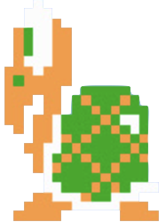

# SuperMario

This is the final project of the "Java Programming" course at Peking University. Our team name is "So What Should We Call Ourselves?"

# User Guide

Welcome to the Super Mario Game! This guide will provide you with instructions on how to control Mario, the game character, and introduce you to the Monster Encyclopedia.

## Game Controls

Move: Press "A" to move left, "D" to move right.

Jump: Press "SPACE" to jump, and the longer you press it, the higher Mario jumps.

Sliding on the wall: When Mario is attached to the wall (taking the left side as an example), holding key "A" can slide down the wall at a lower speed.

Jumping on the wall: When Mario is attached to the wall (taking the left side as an example), press "D" and "SPACE" at the same time to achieve jumping on the wall to the upper right side.

Dash: Press key "L", Mario will dash forward in the direction he is facing, and the dash process will not be affected by gravity. Note that Mario can only dash once in the air and it can only be restored when landing on the ground.

Exit game: ESC key

## TIPS

1. Mario has a total of 3 lives, with one life deducted for each death (falling into a trap or hitting an enemy) and reborn in the current plot. If all 3 lives are lost, Mario will reborn in the first plot of the level.

2. For enemies, falling on top of their head can kill them and get scores, but touching them in other directions will cause Mario to die.

3. For double-side walls, alternately press "A+SPACE" and "D+SPACE" to make Mario jump on the wall continuously. It is relatively difficult to climb up a single-side wall, but it CAN be achieved through our testing. We hope you can discover this skill.

## Monster Encyclopedia

### Mushroom

- Appearance:
  | Mushroom Alive | Mushroom Corpse |
  |----------------------------------------------------------|-------------------------------------------------------------|
  | 

 | 

 |

- Behavior: The Mushroom moves at a constant speed horizontally, changing direction when it encounters obstacles or reaches the bounda ries.

### Turtle

- Appearance:
  | &nbsp; &nbsp; Turtle Alive &nbsp; &nbsp; &nbsp;| &nbsp;&nbsp; &nbsp;Turtle Corpse &nbsp; &nbsp; |
  |----------------------------------------------------------|-------------------------------------------------------------|
  | 
 
 | 

 |

- Behavior: The Turtle moves quickly when running to the left, but moves slowly when running to the right.

The only way to defeat the monsters is by jumping on top of them. Be cautious and time your jumps correctly to ensure Mario's safety!

## MySQL Configuration

The way of configuring mysql database using IntelliJ IDEA as the development tool(Windows):

- Install mysql database on your own computer.[Download here.](https://www.mysql.com/downloads/)Then add the mysql installation path to the environment variables.
  | 

# Project Roles

In this section, we introduce the project roles and contributions of our team members.

**_Jiakai Mao_** (AsadaSinon1) \
Merge and modify part of other contributors' code. \
Responsible for Design well-balanced levels. \
Responsible for realizing the game background and level internal interface.

**_Dongyi Li_** (rcvjqigp-2) \
Handle Mario's movement,health reduction, level switching, and other related functionalities. \
Design and debug mario's motion-related values.

**_Zhiyue Feng_** (FZYsheep) \
Design and implement the start screen, login interface and level selection interface. \
Use a database to manage users' data.

**_Yutong Yang_** (Selina233) \
Adjust Mario's attributes and values. \
Find and create various artistic textures and graphics. \
Perpare PowerPoint presentation and create a demo video. \
Handle enemy movement, death, and related behaviors.

We have achieved a fair distribution of work, and each member has contributed to this project.

# Updates

In this section, we introduce the important updates.

### May 16th

- We successfully formed a team and created this repository on GitHub.

### May 23rd

- We have completed the testing of Mario's wall jump mechanic and plan to incorporate the sprint and long jump mechanics.

### May 27th

- We finished the beautiful Game enter interface and uploaded all the textures of Mario

### May 30th

- We implemented the Enemy class and its subclass Mushroom.
- The Mario class implemented the ability to sprint.
- We completed the initial code integration and decomposed the Mario class.
- We attempted and implemented a simple map design.

### June 1st

- The Plot class has been designated as an inner class of the Map class, and corresponding inner classes with appropriate file structures have been added to facilitate future map design. This improves code maintainability.
- The Plot class implements the JPanel class and the KeyListener interface, while the Backstage class implements the JFrame class and the Runnable and ActionListener interfaces.
- We replaced the while loop in the run function with the start function of a Timer object to prevent blocking the event dispatch thread.

### June 3rd

- We have addressed several bugs to make the gameplay smoother.
- We have separated abilities such as sprinting, wall jumps, and wall grabs, making Mario's abilities controllable.
- We have introduced a password mechanism that requires SQL database support.

**_It's a significant milestone that the game prototype has taken shape and is playable even without enemies._**

### June 5th

- We have completed the collision mechanism between Mario and the Enemy.

### June 6th

- We have updated the subclass Turtle of the Enemy class.
- We have added pause functionality for BackStage class.
- We have created presentation slides for demonstration purposes.
- We have successfully completed the final presentation of the course.
